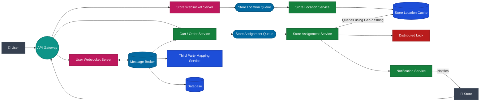

# Quicky Store Assignment Architecture

This architecture adapts the Uber Rider-Driver matching workflow for Quicky's User-Store model. It ensures real-time notifications, geo-hash based store discovery, and reliable assignment using distributed locks.

## User Review Required

Please review the proposed architecture diagram and the step-by-step flow below.

> [!IMPORTANT]
The design strictly replicates the Uber model provided in your description and image, substituting Riders for Users and Drivers for Stores. Let me know if this accurately reflects your intent before we proceed to any implementation steps.
> 

## Open Questions

1. **Message Broker Topics**: You mentioned the store subscribing to topics like "chips to jims rohini sector -5". Are these topics dynamically created per cart/item, or are they static regional topics (e.g., `orders.rohini-sector-5`) that stores subscribe to based on their location?
2. **Acceptance Flow**: When a store accepts an item, the database is updated to `accepted`. Should the system immediately release the distributed lock for this item, and how do we handle timeouts if a store doesn't respond within a specific timeframe?
3. **Geo-hashing**: Do you have a preferred technology for the Store Location Cache (e.g., Redis Geospatial indexes, PostGIS)?

## Proposed Architecture Diagram

## Step-by-Step Data Flow

1. **Connection & Subscription**:
    - Users and Stores open the Quicky app, establishing connections via the **API Gateway**.
    - The Store connects to the **Store Websocket Server** and subscribes to location-specific topics (e.g., `rohini-sector-5`) in the **Message Broker** for personalized, real-time notifications.
2. **Item Selection & Cart Creation**:
    - The User selects an item. This request is routed to the **Cart / Order Service**.
    - A cart entry is created in the **Database** with the status `created`.
3. **Queueing the Assignment**:
    - The new item is placed onto the **Store Assignment Queue** for async processing.
4. **Store Discovery (Geo-hashing)**:
    - The **Store Assignment Service** pulls the item from the queue.
    - It queries the **Store Location Cache** (populated continuously via the Store Location Service) using geo-hashing to find nearby available stores.
5. **Locking & Notification**:
    - The Assignment Service uses a **Distributed Lock** to ensure the order is only offered to one store at a time.
    - It sends a notification to the selected store via the **Notification Service**.
6. **Acceptance & Routing**:
    - If the Store accepts, the Cart/Order Service updates the **Database** status to `accepted`.
    - A success message is sent back to the User via their websocket connection.
    - **Third Party Mapping Services** are utilized to generate the optimal route between the Store and the User location for delivery.